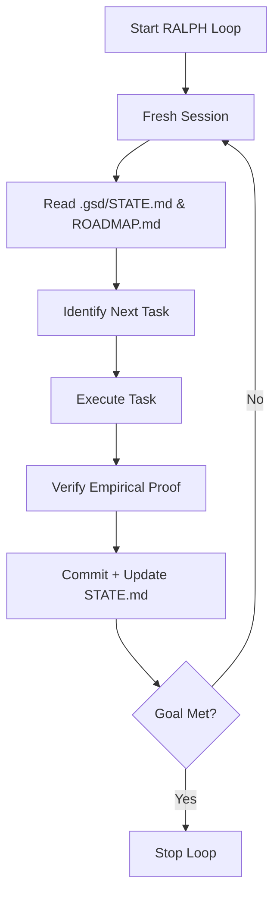

# RALPH Loop — Persistent Autonomous Execution

> **"Iteration Beats Perfection"**
> 
> The RALPH (Recursive Agentic Loop for Project Handling) loop is a foundational technique for long-running, autonomous development. It replaces single-shot attempts with a persistent loop that enforces context hygiene.

---

## Core Philosophy

Named after Ralph Wiggum (who "just keeps trying"), this loop ensures that:
1. **Fresh Context**: Every task starts in a fresh session to prevent context rot.
2. **Externalized State**: Progress is recorded in `.gsd/STATE.md`, not the agent's memory.
3. **Automatic Re-anchoring**: The agent reads the codebase and logs at the start of every iteration.
4. **Stop Hooks**: The loop terminates only when specific criteria are met.

---

## How it works with GSD

The RALPH loop is the **orchestrator** for the GSD methodology's **EXECUTE** phase.



---

## Implementation

### Prerequisites
- GSD installed (`.gsd/`, `.agent/`, etc.)
- Git initialized

### Running the Loop

Use the provided scripts in the `scripts/` directory:

**PowerShell (Windows):**
```powershell
.\scripts\ralph.ps1
```

**Bash (Linux/Mac):**
```bash
./scripts/ralph.sh
```

### Stop Hooks
The loop will continue as long as `ROADMAP.md` has incomplete tasks or until the agent explicitly signals completion.

---

## Best Practices
- **Atomic Tasks**: Keep tasks small so that a single loop iteration is focused.
- **Search-First**: Always let the agent search the repo at the start of each iteration.
- **Manual Oversite**: Monitor the `STATE.md` and `JOURNAL.md` to ensure the agent isn't stuck.

---

*GSD + RALPH: Making autonomous development reliable.*
